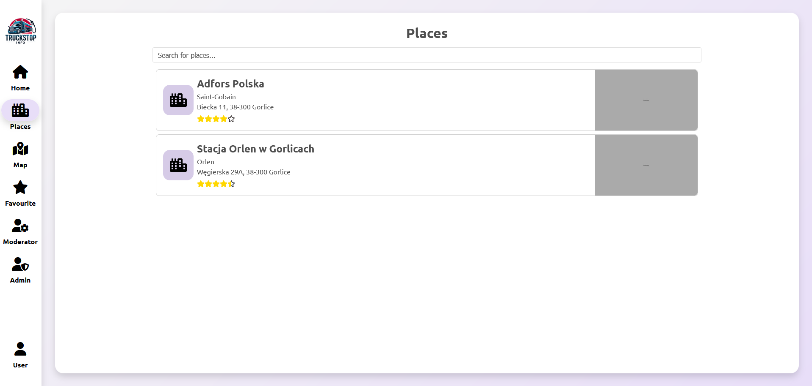
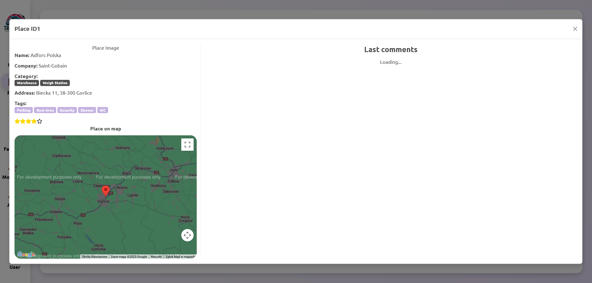
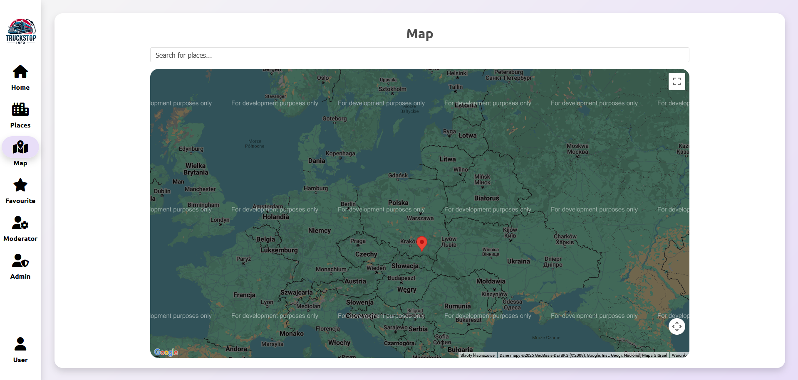
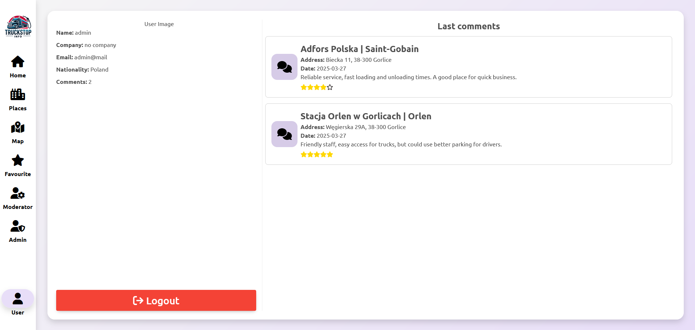
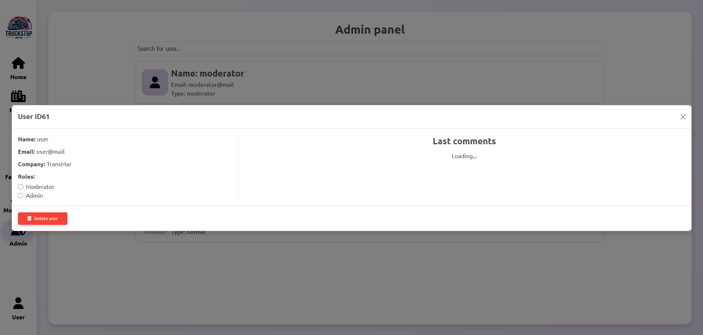

# WDPAI Project

## Overview

TruckStopInfo is a specialized **web application** designed exclusively for professional truck drivers. The platform serves as a comprehensive tool for exploring, reviewing, and sharing information about key facilities and amenities at various locations, such as truck stops, warehouses, fuel stations, and rest areas. It empowers drivers to make informed decisions about where to stop, refuel, rest, or unload cargo, based on real user feedback and detailed facility information.

Built using **PHP**, **PostgreSQL**, and **JavaScript**, TruckStopInfo features a responsive frontend powered by **SCSS** and is containerized with **Docker** for seamless deployment and development.

### Key Features
- **Facility Exploration**: Browse detailed information about truck stops, warehouses, fuel stations, and other facilities, including available amenities like parking, showers, restrooms, and Wi-Fi.
- **User Reviews and Ratings**: Share experiences by leaving reviews and ratings for facilities, helping other drivers make better decisions.
- **Interactive Map**: Integration with **Google Maps API** to dynamically display facility locations and their details.
- **Amenity Indicators**: Clearly see which facilities offer specific amenities, such as restrooms, showers, internal parking, or dining options.
- **Advanced Search and Filtering**: Quickly find facilities based on type, location, or specific features like parking availability, fuel prices, or additional services.
- **Responsive Design**: Optimized for mobile devices, ensuring usability on the road.

### Use Cases
TruckStopInfo is tailored to meet the needs of professional truck drivers:
1. **Finding Facilities**: Locate nearby truck stops, fuel stations, or rest areas with specific amenities like showers or secure parking.
2. **Reviewing Locations**: Share feedback about facilities, such as cleanliness, service quality, or availability of amenities.
3. **Planning Stops**: Use the interactive map and search tools to plan efficient routes with convenient stops.
4. **Community Insights**: Benefit from the collective knowledge of other drivers through reviews and ratings.

### Facility Types
The platform supports a wide range of facility types, including:
- **Truck Stops**: Comprehensive facilities offering parking, fuel, and rest areas.
- **Fuel Stations**: Locations providing fuel and additional services like truck washes or minor repairs.
- **Warehouses**: Loading and unloading zones with information about internal parking, restrooms, or waiting areas.
- **Rest Areas**: Comfortable spots for drivers to rest and refresh during long journeys.
- **Additional Features**: Facilities with amenities like Wi-Fi, showers, restaurants, or secure parking.

TruckStopInfo is a one-stop solution for professional truck drivers to explore,

---

## Database Structure

The database is implemented in **PostgreSQL** and follows a relational model. Below is an overview of the key components:

### Tables
The database consists of the following tables:
- **`tb_user`**: Stores user information, including their company, nationality, and unique identifiers.
- **`tb_place`**: Stores information about places, such as name, address, coordinates, and associated companies.
- **`tb_comment`**: Stores user comments and ratings for places.
- **`tb_company`**: Stores information about companies.
- **`tb_nationality`**: Stores nationality information.
- **`tb_role`**: Stores roles for users.
- **`tb_type`**: Stores types of places (e.g., gas station, hotel).
- **`tb_additional`**: Stores additional features for places (e.g., parking, Wi-Fi).
- **`rel_user_role`**: Links users to roles.
- **`rel_place_type`**: Links places to their types.
- **`rel_place_additional`**: Links places to additional features.
- **`tb_login`**: Stores user login credentials.
- - **`tb_favourite`**: Stores favourite places for users.

### Views
The database includes the following views:
- **`vw_user`**: Combines user information with roles, companies, and nationalities.
- **`vw_place`**: Combines place information with types and additional features.
- **`vw_comment`**: Combines comments with user, place, and company information.

### Functions
The database includes several functions to simplify operations:
- **`fcn__avg_rating(p_place integer)`**: Calculates the average rating for a given place.
- **`fcn__getRoles(p_special_id uuid)`**: Retrieves all roles assigned to a user.
- **`fcn__getCommentByPlace(p_place integer)`**: Retrieves all comments for a specific place.
- **`fcn__loginUser(p_email character varying, p_password character varying)`**: Authenticates a user and returns their unique ID.
- **`fcn__registerUser_wrapper(p_name character varying, p_email character varying, p_password character varying)`**: A wrapper function for user registration.

### Procedures
The database includes the following procedures:
- **`prc__registerUser(p_name, p_email, p_password)`**: Registers a new user.
- **`prc__updateUserRoles(p_user_id, p_roles)`**: Updates the roles assigned to a user.

---

## Relationships and Constraints

### Relationships
- **`tb_user`**:
  - `ID_company` → `tb_company(ID_company)` (Foreign Key, `SET NULL` on delete).
  - `ID_nationality` → `tb_nationality(ID_nationality)` (Foreign Key, `SET NULL` on delete).
- **`tb_comment`**:
  - `ID_user` → `tb_user(ID_user)` (Foreign Key, `CASCADE` on delete).
  - `ID_place` → `tb_place(ID_place)` (Foreign Key, `CASCADE` on delete).
- **`rel_user_role`**:
  - `ID_user` → `tb_user(ID_user)` (Foreign Key, `CASCADE` on delete).
  - `ID_role` → `tb_role(ID_role)` (Foreign Key, `CASCADE` on delete).
- **`rel_place_type`**:
  - `ID_place` → `tb_place(ID_place)` (Foreign Key, `CASCADE` on delete).
  - `ID_type` → `tb_type(ID_type)` (Foreign Key, `CASCADE` on delete).
- **`rel_place_additional`**:
  - `ID_place` → `tb_place(ID_place)` (Foreign Key, `CASCADE` on delete).
  - `ID_additional` → `tb_additional(ID_additional)` (Foreign Key, `CASCADE` on delete).
- **`tb_login`**:
  - `ID_user` → `tb_user(ID_user)` (Foreign Key, `CASCADE` on delete).
- **`tb_favourite`**:
  - `ID_user` → `tb_user(ID_user)` (Foreign Key, `CASCADE` on delete).
  - `ID_place` → `tb_place(ID_place)` (Foreign Key, `CASCADE` on delete).

### Constraints
- Primary keys are defined for all tables.
- Unique constraints are applied to ensure data consistency:
  - `tb_login.email` (Unique).
  - `tb_place.address_place` (Unique).
  - `tb_role.name_role` (Unique).
  - `tb_type.name_type` (Unique).
  - `tb_additional.name_additional` (Unique).

---

## Transactions and Triggers

### Transactions
- **`fcn__registerUser_wrapper`**: Executes the `prc__registerUser` procedure within a transaction to ensure atomicity and data consistency during user registration.

### Triggers
- **`tb_user`**: Monitors changes to the `tb_user` table and logs all modifications into the `tb_log` table for auditing purposes.
- **`tb_place`**: Monitors changes to the `tb_place` table and logs all modifications into the `tb_log` table for auditing purposes.
- **`tb_comment`**: Monitors changes to the `tb_comment` table and logs all modifications into the `tb_log` table for auditing purposes.

---

## Project Structure
```
WDPAI/
├── public/
│   ├── classes/          # PHP classes for database and business logic
│   ├── scripts/          # JavaScript and PHP scripts
│   │   ├── js/           # Frontend JavaScript modules
│   │   ├── php/          # Backend PHP scripts
│   ├── styles/           # SCSS and CSS files
│   ├── views/            # PHP views for different pages
│   ├── img/              # Images used in the application
├── docker/
│   ├── db/               # Database Docker setup
│   ├── nginx/            # Nginx Docker setup
│   ├── php/              # PHP Docker setup
├── docker-compose.yaml   # Docker Compose configuration
├── index.php             # Entry point for the application
├── Router.php            # Router class for handling routes
├── Application.php       # Main application class
```

---

## Setup Instructions

### Prerequisites
- Docker and Docker Compose installed on your system.

### Steps
1. Clone the repository:
   ```bash
   git clone https://github.com/Waither/WDPAI
   cd WDPAI
   ```

2. Build and start the Docker containers:
   ```bash
   docker compose up --build
   ```

   This command will build and start the application along with a pre-configured database containing sample data for testing.

3. Access the application in your browser:  
   [`http://localhost:8080`](http://localhost:8080)

   #### Pre-configured users:
   - Admin:
     - Email: **`admin@mail`**
     - Password: **`admin`**
   - Moderator:
     - Email: **`moderator@mail`**
     - Password: **`moderator`**
   - User:
     - Email: **`user@mail`**
     - Password: **`user`**

4. Access pgAdmin for database management:  
   [`http://localhost:5050`](http://localhost:5050)
   - Default credentials:
     - Email: `admin@example.com`
     - Password: `admin`

---

## Screenshots

#### Places


#### View one place


#### Map


#### User panel


#### Edit user as Admin


---

### Authors
- Gąsior Maciej
